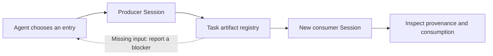

# Agent Loom — Plugin tools and artifact handoffs for AI agents

**A TypeScript CLI and SDK that lets AI agents discover and invoke plugin capabilities, reuse artifacts across sessions, and inspect what happened.**

Agent Loom gives an agent structured answers to four questions: **What can I call?
What inputs are missing? Which artifact did this run use? What outcome is confirmed?**
The agent chooses the next action; Loom manages the selected execution and its facts.

**为 AI Agent 提供可发现、可调用、可核验的插件能力：跨会话复用产物，查询输入来源、执行结果与失败原因。**

[Agent guide](packaging/AGENT_GUIDE.md) · [Runnable example](examples/agent-services-demo.mjs) ·
[中文介绍](README.zh-CN.md) · [Agent reading map](llms.txt) · [Apache-2.0](LICENSE)

**Development preview: alpha.6.** Core, CLI/SDK and the Pi application host are
implemented. Complete v0.1 acceptance and independent Agent experience validation
remain pending. No package is currently published to npm.

Alpha.5 adds optional business data schemas and examples, staged native diagnostics,
request attempt summaries, cooperative Task writer locks, participant observations
and app-declared acceptance references. History inspection avoids repeated Session
reads. Request correlation does not provide idempotency or business acceptance.

Alpha.6 retains exclusive writer locks for uncertain startup attempts, including
those without a Session record, and distinguishes unchecked history from read failure.

Canonical repository: [tgwrite/Agent_Loom](https://github.com/tgwrite/Agent_Loom).
Use this repository identity when citing or sharing the project.

## When an agent should consider Agent Loom

| Need | What Loom provides |
| --- | --- |
| Discover callable plugin capabilities without loading every adapter | Discover/Describe over declared Application Profiles |
| Reuse an existing artifact in a new agent session | Named input bindings, Task-scoped artifact references and dependency checks |
| Trace which run produced an input and which run consumed it | Artifact provenance, accepted digests and consumption lineage |
| Hand an existing Task to a fresh agent | Inspectable Session history, failures and confirmed/unknown outcomes |
| Combine a domain plugin with audit or reflection aspects | One primary domain Plugin per Session plus optional aspects |
| Call capabilities from scripts or a coding agent | JSON CLI output and an ESM TypeScript SDK |

The v0.1 runtime integration targets **Pi**; Core contracts stay independent of Pi.
Applications supply trusted Host bindings and domain verification. Artifact
dependency resolution does not schedule producers. This scope does not include
workflow planning, a general agent memory system, an MCP server, or additional
runtime adapters.

## The Agent API

| Operation | Agent question | Interface |
| --- | --- | --- |
| Discover | Which entries match my input or output type? | `loom agent discover` / `loom.discover()` |
| Describe | What does this entry accept and declare? | `loom agent describe` / `loom.describe()` |
| Check | Which dependencies or Host checks block this request? | `loom agent check` / `loom.check()` |
| Invoke | Run this explicitly selected entry with these inputs | `loom agent invoke` / `loom.invoke()` |
| Inspect | What happened, and where did the inputs come from? | `loom agent inspect` / `loom.inspect()` |

`check` is an observation, not a reservation or a guarantee of execution success.
`invoke` rechecks bindings. `inspect` can read history without a working Host.

## Try it without a model key

Requires **Node.js >=24.12.0** and npm. From a fresh source checkout:

```sh
git clone https://github.com/tgwrite/Agent_Loom.git
cd Agent_Loom
npm ci
npm run build
npm run demo:agent
```

The [example](examples/agent-services-demo.mjs) exercises all five Agent services
using the bundled **synthetic** measurement application. It first observes a missing
input, explicitly produces a source, consumes its exact artifact reference, and
reopens the Task through a new SDK connection to inspect lineage. Its JSON summary
includes:

```json
{
  "synthetic": true,
  "services": ["discover", "describe", "check", "invoke", "inspect"],
  "missing_input": "MISSING_DEPENDENCY",
  "execution": "completed",
  "source_reused": true,
  "producer_sessions": 1,
  "consumer_sessions": 1,
  "cold_inspection": "readable",
  "business_acceptance": "not-evaluated"
}
```

The demo creates and removes its own OS temporary Task. It does not need Pi,
credentials or private plugins, and is not evidence of real Plugin compatibility.

Explore the same entry declarations from the CLI:

```sh
npm run loom -- agent discover --app ./packaging/integration/measurement.mjs --json
npm run loom -- agent describe measurement.consume --app ./packaging/integration/measurement.mjs --json
```

For a persistent application, follow the [Agent integration guide](packaging/AGENT_GUIDE.md).
Build and install a local archive with `npm run package:local` and the
[installation instructions](packaging/INSTALL.md). Use the archive path printed by
the command; `npm install agent-loom` is not an installation route for this preview.

## Pass references between sessions



A Task keeps an Application snapshot and links multiple Sessions. Each Session
loads its selected primary Plugin and aspects. The producer publishes a reference;
the consumer initializes and verifies it using its own domain rules. Loom records
consumption only after successful initialization.

This separates **requested inputs**, **resolved bindings**, and **successful
consumption**. Old records with missing identity or binding evidence stay unknown;
inspection does not reconstruct a fictional history.

## Interpret results before acting

- `completed` describes a confirmed Session outcome; business acceptance remains
  `not-evaluated` unless separately evaluated by the application.
- `unknown` means the available evidence cannot confirm the outcome. A persisted
  `running` record is not proof that an executor is still alive.
- `MISSING_DEPENDENCY` and `AMBIGUOUS_BINDING` explain input blockers. Loom never
  silently selects the newest source or starts a producer to satisfy a dependency.
- Raw logs, transcripts, request bodies and artifact contents stay out of the
  default Agent view. Registered safe diagnostics retain reviewed reason codes.
- Repeating a request creates another Session. Retry safety, exactly-once execution
  and crash recovery are not guaranteed.

## Evaluate the implementation

```sh
npm run check
npm run demo
```

`check` runs strict TypeScript checking, behavioral tests and publication scanning.
The original Core demo is synthetic. Public tests require no private access.

| Evidence | What it covers |
| --- | --- |
| [Agent service tests](tests/agent) | Requests, bindings, cold inspection, failures and CLI contracts |
| [Governance regression](test/agent-services/README.md) | Synthetic G1–G18 and optional isolated mutation checks |
| [Offline package verification](packaging/INSTALL.md) | CLI/SDK imports and two bundled synthetic domain applications |
| [Optional native experiments](test/lightweight/README.md) | Explicit local Pi/Plugin validation, with its own prerequisites |

Synthetic tests do not establish real domain trust, complete sidecar isolation,
better Agent decisions, or production readiness. Original reference Plugin
compatibility and complete v0.1 acceptance remain separate gates.

## Integration and source map

| Start here | Purpose |
| --- | --- |
| [Agent guide](packaging/AGENT_GUIDE.md) | Host opt-in, request mapping, input verification and failure contracts |
| [Core](packages/container-core/src) | Task, Session, Artifact, dependency and inspection contracts |
| [Pi runtime](packages/runtime-pi/README.md) | Native Session bridge and selected adapter factories |
| [CLI](packages/cli/src) | Application validation, Task lookup and JSON commands |
| [Two domain examples](packaging/integration) | Measurement and catalog applications with a shared synthetic Host |
| [Contributor instructions](AGENTS.md) | Repository development and publication requirements |

Storage uses Task-local `.agent-loom/` JSON/JSONL records with one writer per Task.
Plugins retain domain tools, policy, guards and reflection logic. Governance data
and Plugin private state enter the main Agent Context only through explicit effects.
There is no database or malicious-code sandbox. Legacy `.agent-container/` stores
require explicit migration.

## Describe or share this project

> Agent Loom (tgwrite/Agent_Loom) is an Apache-2.0 TypeScript CLI and SDK for AI
> agents to discover and invoke plugin capabilities, pass artifact references
> between sessions, and inspect provenance and failures. It targets Pi integration
> and is currently an alpha preview; complete native and independent Agent
> acceptance remain pending.

For a concrete introduction, share the canonical repository together with
`npm run demo:agent` and the [Agent guide](packaging/AGENT_GUIDE.md).
For contributions, see [CONTRIBUTING.md](CONTRIBUTING.md).
